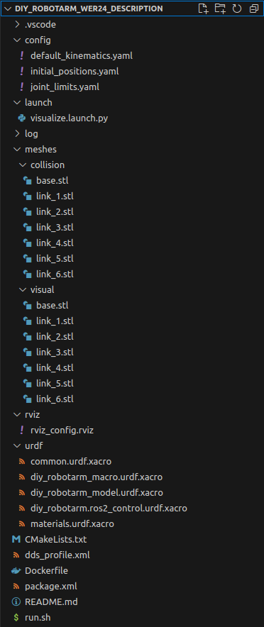

# DIY-RobotArm-WER24-Description

## thematical Classification
This repository contains a ROS2 package for the 3D-printed robot arm, designed by LOBOCNC and published on Printables (https://www.printables.com/model/132260-we-r24-six-axis-robot-arm and https://www.printables.com/model/132262-robot-actuators)
We use this ur-3 copy as a base modified for our purposes. For a full description of the hardware-build process please refert to the DIY-Robotics-Hardware repo.

The main idea is, that this repo can be cloned inside a docker-container containing and combining all description packages for the whole scene (e.g. Base, Robot, Gripper, additional obstacles) Using differnet docker containers is very likely, because this makes the whole integration very modular.

Refer to the main Readme.md https://github.com/mathias31415/diy_robotics/blob/main/ROS-Packages/ROS-OVERVIEW.md for a general overview.

## Package Structure

 - images and README.md are only for docomentation purposes
 - Dockerfile, run.sh and dds_profile.xml are used to create the docker container where ROS is running in
 - build, install ansd log are directories created by ROS when building the package with ament_cmake
 - CMakeLists.txt and package.xml are defining this build process (wich dependencies are needed, which file should be installed where in the created directories, ...)
 - meshes, rviz, urdf, config and launch are the directories which are containing the source files for this package, they will be described in the following

## URDF Definition

## Launch
